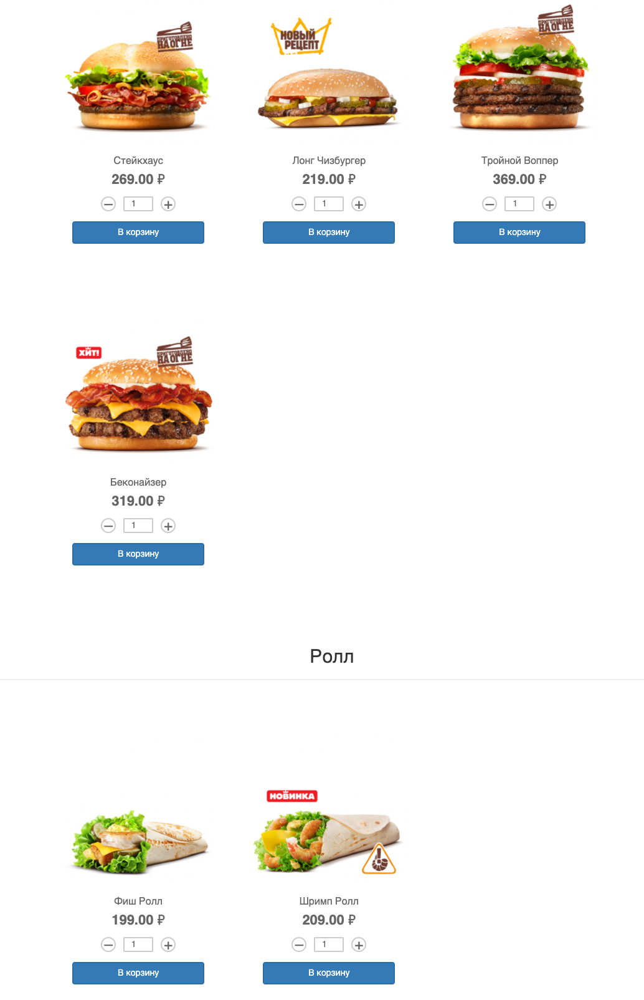
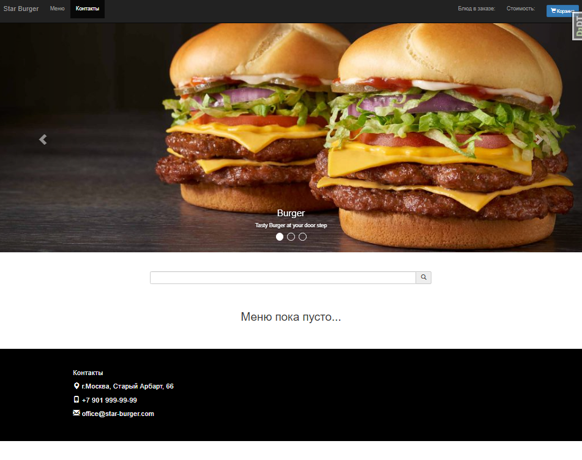

# Сайт доставки еды Star Burger

Это сайт сети ресторанов Star Burger. Здесь можно заказать превосходные бургеры с доставкой на дом.




Сеть Star Burger объединяет несколько ресторанов, действующих под единой франшизой. У всех ресторанов одинаковое меню и одинаковые цены. Просто выберите блюдо из меню на сайте и укажите место доставки. Мы сами найдём ближайший к вам ресторан, всё приготовим и привезём.

На сайте есть три независимых интерфейса. Первый — это публичная часть, где можно выбрать блюда из меню, и быстро оформить заказ без регистрации и SMS.

Второй интерфейс предназначен для менеджера. Здесь происходит обработка заказов. Менеджер видит поступившие новые заказы и первым делом созванивается с клиентом, чтобы подтвердить заказ. После оператор выбирает ближайший ресторан и передаёт туда заказ на исполнение. Там всё приготовят и сами доставят еду клиенту.

Третий интерфейс — это админка. Преимущественно им пользуются программисты при разработке сайта. Также сюда заходит менеджер, чтобы обновить меню ресторанов Star Burger.

## Как запустить dev-версию сайта

Для запуска сайта нужно запустить **одновременно** бэкенд и фронтенд, в двух терминалах.

### Как собрать бэкенд

Скачайте проект:

```sh
git clone https://github.com/devmanorg/star-burger.git
```

В проекте используется [Python](https://www.python.org/downloads/release/python-3100/), версии 3.10.1

Проверьте, что `python` установлен и корректно настроен. Запустите его в командной строке:

```sh
python --version
```

В каталоге проекта создайте виртуальное окружение:

```sh
python3.10 -m venv env
```

Активируйте его. На разных операционных системах это делается разными командами:

- Windows: `.\env\Scripts\activate`
- MacOS/Linux: `source env/bin/activate`

Перейдите в каталог проекта:

```sh
cd star-burger
```

Установите зависимости в виртуальное окружение в зависимости от того, где разворачиваете приложение:
- dev.txt - локальная развертка
- prod.txt - разворачивание проекта в продакшене

```sh
pip install -r requirements/dev.txt --use-deprecated=legacy-resolver
```

or

```shell
pip install -r requirements/prod.txt
```

Вам необходимо задать следующие переменные окружения:

| ENVIRONMENT VARIABLE | DESCRIPTION                                                                                                                                                                                      |
|----------------------|--------------------------------------------------------------------------------------------------------------------------------------------------------------------------------------------------|
| DEBUG                | При локльной разразботке выставить True (по дефолту установлен False).                                                                                                                           |
| SECRET_KEY           | Секретный токен django, желательно задать собственный ключ. При разработке можно использовать дефолтный.                                                                                         |
| YANDEX_MAP_APIKEY    | Апи ключ от яндекс карт. Нужно получить на странице для разработчиков [Yandex maps](https://passport.yandex.ru/auth?origin=apikeys&retpath=https%3A%2F%2Fdeveloper.tech.yandex.ru%2F).           |
| ALLOWED_HOSTS        | При локальной разработке вы можете пользоваться дефолтным, но на проде необходимо прописать свои хосты.                                                                                          |
| ROLLBAR_ACCESS_TOKEN | Получение токена rollbar для оповещения об ошибках в реальном времени и мониторинга приложения. [RollBar website](https://rollbar.com/)                                                          |  
| ROLLBAR_ENVIRONMENT  | Установка где отлавливать исключения и мониторить приложение: development or production. По умолчанию *production*                                                                               |
| DATABASE_URL         | Подключение бд к проекту. По дефолту создается и подключается sqlite. Data base url нужно прописывать по [схеме](https://django-environ.readthedocs.io/en/latest/types.html#environ-env-db-url)  |

Переменная окружения создается несколькими способами

1. Либо положите все в файлик 

Создайте файл базы данных SQLite и отмигрируйте её следующей командой:

```sh
python manage.py migrate
```

Запустите сервер:

```sh
python manage.py runserver
```

### Подключить фронтенд

Для работы сайта в dev-режиме необходима одновременная работа сразу двух программ `runserver` и `parcel`. Поэтому фронтэнд нужно запустить в отдельном окне терминала.

[Установите Node.js](https://nodejs.org/en/), если у вас его ещё нет.

Проверьте, что Node.js и его пакетный менеджер корректно установлены. Если всё исправно, то терминал выведет их версии:

```sh
node -v
# v12.18.2
npm --version
# 6.14.5
```

Версия `nodejs` должна быть не младше 10.0. Версия `npm` не важна.

Установите необходимые пакеты. В каталоге проекта запустите:

```sh
npm install --dev
```

Установите [Parcel](https://parceljs.org/). Это упаковщик веб-приложений.

```sh
sudo npm install -g parcel-bundler  # понадобятся права администратора `sudo`
```

Проверьте, что `parcel` установлен. Запустите его в командной строке:

```sh
parcel --version
```

Сама версия не важна. Главное — это чтобы `parcel` "завёлся".

Почти всё готово. Теперь запустите сборку фронтенда и не выключайте. Parcel будет работать в фоне и следить за изменениями в JS-коде:

```sh
parcel watch bundles-src/index.js -d bundles --public-url="./"
```

Дождитесь завершения первичной сборки. Это вполне может занять 10 и более секунд. О готовности вы узнаете по сообщению в консоли:

```sh
✨  Built in 10.89s
```

Откройте сайт в браузере по адресу [http://127.0.0.1:8000/](http://127.0.0.1:8000/). Вы должны увидеть:



Каталог `bundles` в репозитории особенный — туда Parcel складывает результаты своей работы. Эта директория предназначена исключительно для результатов сборки фронтенда и потому исключёна из репозитория с помощью `.gitignore`.

## Как запустить prod-версию сайта

Собрать фронтенд:

```sh
parcel build bundles-src/index.js --dist-dir bundles --public-url="./"
```

- DEBUG — дебаг-режим. Поставьте False.
- SECRET_KEY — секретный ключ проекта, лучше заменить на собственный.
- ALLOWED_HOSTS — [см. документацию Django](https://docs.djangoproject.com/en/3.1/ref/settings/#allowed-hosts)


## Цели проекта

Код написан в учебных целях — это урок в курсе по Python и веб-разработке на сайте [Devman](https://dvmn.org). За основу был взят код проекта [FoodCart](https://github.com/Saibharath79/FoodCart).
